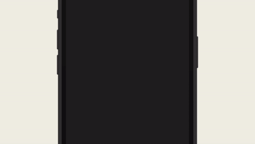
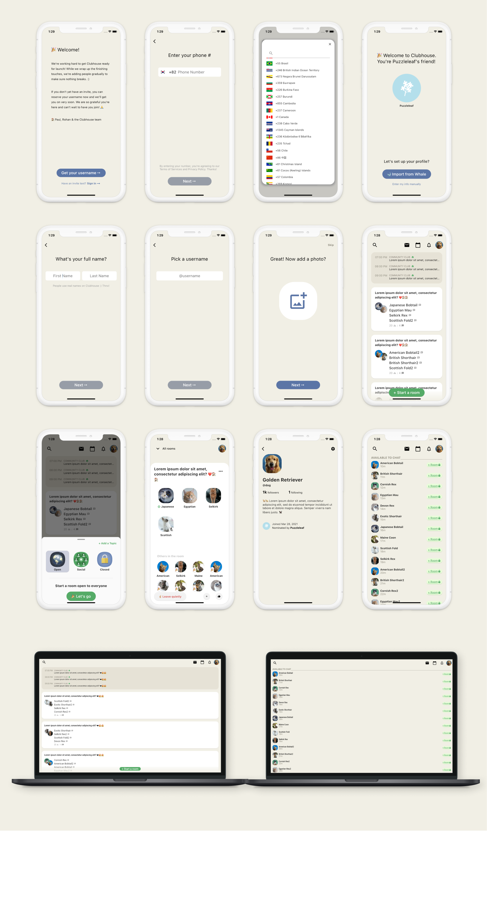
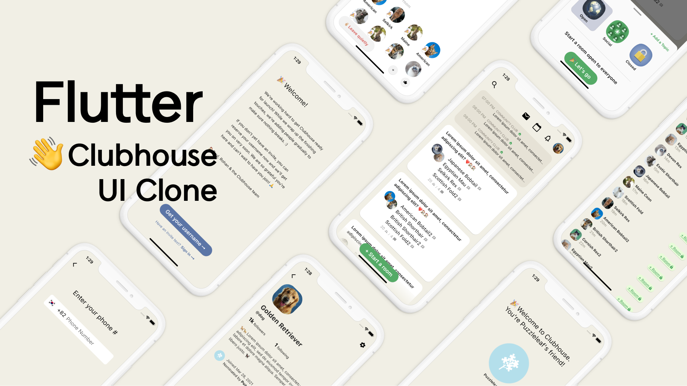

# 👋 Flutter Clubhouse UI Clone 

This project was made by referring to the Clubhouse app.

 

## Preview

 

## Flutter Web

Flutter has been upgraded to 2.0 so you can build a web in the stable version.

~~~
flutter run -d chrome
~~~

## Youtube
[Flutter Clubhouse App UI Clone - SpeedCode](https://youtu.be/82yRZZ2ydmE)

 

## Packages
* country_code_picker : https://pub.dev/packages/country_code_picker

* pull_to_refresh : https://pub.dev/packages/pull_to_refresh
